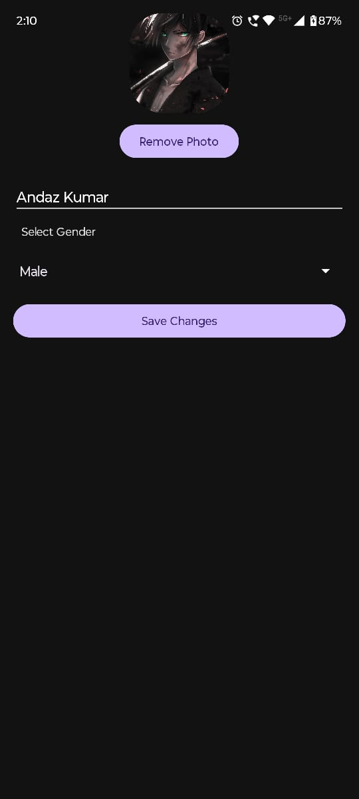

## 🧑‍💼 Features

- View and edit user name
- Select gender using a dropdown
- Upload or remove a profile picture from gallery
- Save and load profile data using SharedPreferences

## 🛠️ Tech Stack

- Kotlin
- Android SDK
- SharedPreferences for local storage
- XML for UI layout

## 📸 Screenshots

| Profile Page | Edit Mode |
|--------------|-----------|
|  |  |


## 🧪 How to Run

1. Clone the repository:
    ```bash
    git clone https://github.com/goddarkside/profile-section.git
    ```
2. Open the project in **Android Studio**
3. Connect an emulator or Android device
4. Click **Run**

## 📝 Notes

- Permissions handled for API 33+ (`READ_MEDIA_IMAGES`) and older (`READ_EXTERNAL_STORAGE`)
- Default profile image is shown if none is selected
- UI designed to be similar to the sample image provided

## 📂 Folder Structure

app/
└── src/
└── main/
├── java/com/android/pransh/profilesection/
│ └── MainActivity.kt
├── res/
│ ├── layout/
│ │ └── activity_main.xml
│ ├── drawable/
│ │ └── profileimg.png, circle_background.xml
│ └── values/
│ └── strings.xml
└── AndroidManifest.xml


## 🙋‍♂️ Contact

For any queries or clarifications, feel free to reach out via Email- prashantseth780@gmail.com Number - 9198492131

---

**Thank you for the opportunity! 🙌**
